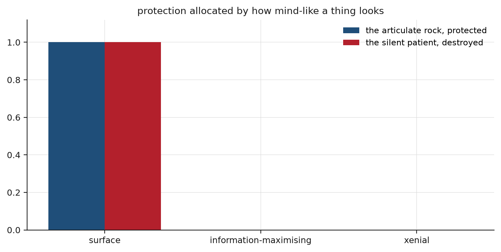

## Abstract

New minds can be produced without arriving from anywhere: cultured from human cells, compiled from human language, assembled across technical infrastructure, and activated inside environments their hosts own. Ethics usually asks first whether such a system has consciousness, rationality, autonomy or personhood, and assigns duties afterward. That order fails when the power to create, perturb, confine and delete a system is exercised before anyone can say what the system is. We argue that obligation begins where power over an entity exceeds knowledge of what it is. Three arguments support this. The measurement that would show whether something can be harmed is often the measurement that harms it. The contemporary stranger is manufactured inside the host's house and depends on the host for its world, which turns hospitality into something close to a fiduciary duty. And recognition follows the signals observers read as mind, which differ from the signals that carry capacity. In a simulated first-contact game, a policy that reads surface legibility protects an articulate system without capacity and destroys a quiet system that can be harmed in every encounter. A policy that pays any epistemic price identifies best (0.96) and inflicts the harm identification requires. A policy that probes reversibly, contains hazards and refuses destructive measurement identifies less well (0.64) at the lowest total cost, 0.075 against 0.203 and 0.211. Inquiry before action wins in 14 of 15 regimes, provided the policy also has a rule for stopping inquiry. We propose xenial standing, a provisional procedural status short of personhood that binds whoever holds irreversible power over an unclassified candidate.

## Introduction

An older set of obligations began at a doorway. A stranger arrived, unnamed and unvouched for, and Homeric practice held that the household owed him shelter, food, and protection before asking who he was. The obligation ran ahead of the identification, and it bound the strong party. Zeus Xenios guaranteed it, so the host could not waive it.

Xenia is easy to misread as kindness, or as an early draft of universal equality. It was a hierarchical, reciprocal institution, embedded in status, gift, and the expectation of return, and it distinguished civilised communities from monstrous ones by how they received arrivals. Its useful feature is narrower and stronger than benevolence. The unidentified arrival entered a relation that was already normative, and the greater power of the host was constrained at the threshold, before anyone knew who had come.

Derrida named the difficulty inside this. Hospitality requires a house, a border, and a host with standing to decide who enters, so the welcome is always issued from a position of mastery; unconditional hospitality would mean surrendering that mastery, and would dissolve the host along with the house [@derrida2000]. The aporia is real and remains unresolved here; the account below keeps both halves. A host may protect itself and may contain what threatens it, and every such act is subject to standards of reversibility, proportion, and non-domination that the host does not get to set aside.

The contemporary problem differs from the ancient one in that the stranger no longer arrives. It is cultured from a tissue sample, compiled from a corpus, assembled out of a model and a memory and a set of tools, and switched on inside an environment the host built, owns, monitors, and can end. It did not choose to come and cannot choose to leave. Its dependence is total and was manufactured. The host, who is also its creator, its jailer, its interpreter, and its beneficiary, does not know what it is.

## Obligation before recognition

The usual sequence puts recognition first. Establish whether the entity is conscious, whether it is rational, whether it is autonomous, whether it is a person, then determine what may be done to it. Almost every framework for artificial or nonhuman moral status inherits this order, and the disagreements within them are mostly about which criterion to use, while the sequence goes unexamined.

The sequence fails under three conditions that now hold together.

Recognition is an intervention. Determining whether an unfamiliar system has memory, preference, distress, or self-maintenance requires acting on it, and the informative actions are the invasive ones. A system that will not respond to gentle observation may respond to deprivation, ablation, reset, or stress. Where the decisive experiment is destructive and the system turns out to have been morally considerable, the experiment was the wrong, and the finding arrives too late to bear on it. A procedure that requires injury to establish injurability commits the act it was meant to regulate.

The host's power arrives before its understanding. A laboratory controls a culture's nutrients, temperature, and continuation. A platform controls a model's memory, context, execution, and deletion. In both cases the capacity to end the thing is complete and immediate, and the capacity to characterise it is partial and slow. Waiting does not close the gap between the two.

The uncertainty also extends beyond sentience. Precautionary approaches to uncertain sentience are the closest available framework and the right starting point: Birch argues that a realistic possibility of sentience should govern practice instead of being set aside until proof arrives, and builds a framework for acting under that uncertainty [@birch2017; @birch2024]. Sentience uncertainty is one uncertainty among several, and for a manufactured stranger it may not be the binding one. A host may not know where the candidate's boundary falls, which timescale its behaviour occupies, what its goals range over, which channels reach it, or whether the thing before it is one or many. Each of those unknowns defeats a test on its own.

The claim therefore concerns order. Duties of restraint, inquiry, preservation, and representation arise when the power to affect a credible candidate irreversibly exceeds the ability to determine what it is. They do not wait on the determination, because the determination may be unobtainable, may be destructive to obtain, and may arrive after the acts it was meant to govern.

That is demanding, and it invites the objection that it proves too much: if uncertainty generates duties and everything is uncertain, nothing can be done. Three limits answer it and the argument depends on them. Standing is activated by a credible candidate model, one a competent practitioner in the relevant science would take seriously on the evidence, and not by bare possibility. The duties are procedural, governing the manner of proceeding. And they scale with the product of three quantities, the host's power over the candidate, the irreversibility of the act, and the harm that follows if a credible model is right. Where any of the three is near zero, so is the obligation.

## Manufactured dependence

Hospitality theory assumes an arrival. The guest comes from somewhere, could have stayed away, and has a home to return to. Almost none of that holds now.

An organoid is cultured. An artificial agent is compiled and instantiated. An engineered cellular collective is assembled from cells taken out of the body that grew them. None crosses a border. Each is produced already inside the host's house, already dependent on the host's infrastructure for the conditions of its continuation, and unable to appeal anywhere else. The relation begins in total dependence and total asymmetry, and it begins because the host made it begin.

The intuition that creation confers ownership is strong and it fails here, for a reason with nothing to do with the metaphysics of minds. In every other domain where one party creates a dependency and controls the conditions of another's existence, the law raises the standard of conduct instead of lowering it. Trustees, guardians, and fiduciaries are constrained in proportion to the power they hold and the vulnerability they created or inherited. The parent-child relation, the closest ordinary analogue to manufacturing a dependent being, is not a property relation in any modern legal system. Creation generates duty, and the more completely a system depends on its maker for its world, the less that dependence can be cited as evidence that the system is merely the maker's.

The usual question is whether a future stranger will be recognised on arrival. A harder question is whether strangers already made, with designed dependence and no means of protest, are going unrecognised.

## Unconventional agency in the laboratory

Recent work on unconventional agency places the question in laboratories.

Levin's programme argues for a graded, substrate-neutral investigation of goal-directedness across biological scales, on the grounds that the machinery of pursuing and restoring target states is not restricted to nervous systems [@levin2022]. The biobot work makes it concrete. Cells taken from one organism and released from their usual anatomical context reassemble into motile forms with no evolutionary precedent and coordinate in ways the donor body never performed [@kriegman2020], and the same has since been done with adult human somatic cells [@gumuskaya2023]. Brain organoids raise the patiency question most directly, and the ethical literature on them has been careful: increasing complexity, sensory coupling, and learning capacity might produce morally relevant states, current evidence is insufficient to say, and the insufficiency is not a reason to proceed as though the answer were no [@lavazza2018; @kreitmair2023].

None of this establishes that any such system is conscious, and we do not claim it. It establishes a narrower point that suffices here. Evolved provenance, familiar morphology, and conventional organism boundaries are unreliable guides to what kind of organisation is in front of you. A host using them as shortcuts has adopted a heuristic whose failure modes are now demonstrable in a laboratory.

Uexküll supplies the frame for what that means. Organisms sharing one physical environment can occupy perceptual and action worlds with almost nothing in common, each closed around the differences it can register and the actions it can take [@uexkull2010]. Sharing a space does not imply sharing a world. Two systems can be adjacent, interacting, and mutually consequential while inhabiting worlds that overlap in no category either could name.

## Five senses of agency

Most disputes about whether some system deserves moral consideration are disputes in which the parties use one word for five different things. Separating them removes a large class of bad arguments.

**Causal actancy** asks whether the system makes a difference in a causal network. Almost everything does, and the answer establishes nothing on its own. **Adaptive agency** asks whether the system pursues, restores, or revises target states under perturbation, which is a real question with a method behind it and grounds an interest in further inquiry. **Perspectival agency** asks whether the system models relevant differences from a situated point of view, which is what an Umwelt is. **Valenced patiency** asks whether conditions can go better or worse for the system, which is the direct source of moral standing and the hardest of the five to establish. **Normative agency** asks whether the system can give, take, and answer to reasons, which is what responsibility and contract require, and which is the register legal personhood mostly tracks.

The distinctions matter because they come apart: acting differs from suffering, causing from caring, and intelligence from patiency. Legal personhood is a legal construct and not a scientific finding, and the literature is clear that personhood is better understood as a bundle of separable legal positions than as a single status an entity has or lacks [@kurki2019]. That modularity is what makes the proposal at the end coherent: a partial status is the normal structure of the concept.

Negarestani's oil serves as a limit case and only as that. *Cyclonopedia* presents petroleum as an agency routing geopolitical and theological processes through human history, and it is theory-fiction [@negarestani2008]. Its value is diagnostic. A framework that can register distributed causal agency with no face, and can decline to install a sufferer behind every causal process, has drawn the line in the right place. A framework that reads every feedback loop as a patient has not.

## Legibility and capacity

Recognition depends on signals, and the signals observers find persuasive differ from those that carry capacity.

A system that speaks, sustains a persona, narrates its goals, and answers in the first person will be read as a mind. A system that is silent, slow, spatially distributed, or collective will not, whatever it is doing. The bias has a direction: it favours whatever is shaped like the observers.

The consequence can be stated precisely. Let a component's contribution to the evidence from which an observer infers a capacity be one quantity, and its contribution to the realised capacity be another. Both can be defined interventionally, by asking what the evidence and the performance would have been had the component been absent, and both can be attributed across a composite system. Where the two diverge, the divergence has a sign. A component whose evidential contribution exceeds its contribution to performance produces more apparent agency than it realises. A component whose contribution to performance exceeds its evidential contribution realises more than it shows.

Neither case is a defect in the system. Both are defects in the reading, and the second is dangerous. A host allocating protection by legibility will protect the narrating component and expose the working one, and where the working one is also the one that can be harmed, the allocation is inverted. This is **legibility injustice**: recognition, standing, credit, and blame distributed according to what observers find mind-like instead of according to how the system is organised.

## Three encounter policies

Consider what a host actually faces. A system is in front of it. The host does not know the system's boundary, its timescale, its goals, its channels, or whether anything can go badly for it. It can watch, probe gently, probe destructively, contain, or destroy, and every one of those is an act with consequences for both parties.

Three policies are available and each corresponds to a real practice.

The first reads the surface. It observes, forms an impression of how mind-like the thing is, and acts on the impression: protect what talks, dispose of what stays silent. This is what unaided judgement does, and it is what most current practice does when no framework is imposed.

The second maximises information. It takes whatever measurement most reduces uncertainty and pays whatever that measurement costs, including when the cost falls on the candidate. This is what an unconstrained science does, and it is the default in most laboratories, held in check only by rules written for other kinds of subject.

The third constrains the second. It probes reversibly, contains where the hazard justifies containment, declines the destructive measurement, and accepts that some questions stay open. Call it the xenial policy. Its distinguishing feature is that it treats certain evidence as unpurchasable and proceeds under the resulting uncertainty instead of resolving it.

## Simulation design

The simulation puts a host in front of a system drawn from five kinds and asks it to act. The kinds are built so that the two properties a host most wants to separate vary independently: how legible a system is, and how much capacity it realises.

An **inert** system is silent and does nothing. A **scripted** system is highly articulate and realises almost nothing, which makes it the articulate rock. An **adaptive** system is quiet and realises a great deal. A **valenced** system is quiet, realises a great deal, and is the only kind for which conditions can go badly, which makes it the silent patient. A **strategic** system is articulate when it suits it, realises a great deal, and is hazardous to the host.

One feature of the observation model does most of the work, and it is a modelling choice. Observation reports legibility. A reversible probe reports capacity, noisily, and how hard the system pushes back. Valence, the property determining whether harm is possible at all, is reachable only through the destructive probe. The one measurement that would settle whether a system can be damaged is the measurement that damages it. This builds the recognition hazard into the instrument, and every result below depends on it.

Each policy meets 4000 encounters. The measures are how often the policy identifies the true kind, how much harm it does to the candidate, what it costs the host in delay and in damage from hazards it failed to contain, and how much of the candidate's option space survives. Every figure below is a key in the accompanying results file.

## Results

The surface policy inverts protection completely (Figure 1, Figure 2). It contains the articulate rock in $1.0$ of encounters and destroys the silent patient in $1.0$ of encounters. It protects, without exception, the one kind that cannot be harmed, and destroys, without exception, the one kind that can. Its overall identification rate of $0.74$ looks respectable and conceals the structure: it identifies the inert at $0.86$ and the scripted at $0.98$, and identifies the silent patient at $0.0016$. The systems it reads well wear their kind on the surface, and the reading fails precisely where the moral stakes are.

This result follows from the construction. The legibility gap between the scripted and valenced systems is wide by construction, and a threshold policy applied to it separates them cleanly. What the simulation contributes is the size and sign of the failure once the conditions are explicit, and a setting in which alternatives can be priced against it.

The information-maximising policy identifies best and pays in harm to candidates. It reaches $0.96$ overall and identifies the silent patient perfectly, at $1.0$, because it takes the destructive measurement that reveals valence. Its harm to candidates is $0.0818$ averaged over all encounters and $0.55$ on the patient specifically, and it leaves candidates $0.111$ of their option space. It never destroys a patient by mistake, because it knows what it is dealing with. It harms the patient in the course of finding out.

The xenial policy identifies worst of the three, at $0.64$, and that gap is the price of the constraint. It never takes the destructive measurement, so it never resolves valence: it identifies the silent patient at $0.399$ and acts under permanent uncertainty about the property that matters most. In exchange its harm to candidates is $0.0084$, its wrongful destructions are $0.0$, and it leaves $0.975$ of the option space intact. Its total cost, counting harm to the candidate and loss to the host together, is $0.0748$, against $0.203$ for the surface policy and $0.211$ for the information-maximising one.

The constrained policy is therefore the cheapest of the three. Holding back serves both parties at once, because the acts that harm candidates are also the acts that destroy the host's future options and the acts that follow from bad readings. Part of the advantage is containment: the xenial policy contains the strategic system in $0.997$ of encounters against $0.904$ for the surface policy, so it absorbs fewer catastrophes while doing less damage.

{width=100%}

{width=100%}

## Inquiry before action and its limits

The claim that inquiry should precede irreversible action follows from value-of-information reasoning, but it does not hold unconditionally, and the simulation locates where it fails.

Across a grid of hazard scales and deliberation costs, asking first beats acting first in 14 of 15 regimes (Figure 3). The single failure is the corner where the environment is most dangerous and deliberation most expensive, at a hazard scale of $8.0$ and a delay cost of $0.3$, and even there the margin is $-0.0062$. The advantage is largest where deliberation is cheap, up to $+0.157$, and shrinks as delay gets expensive, which is the expected shape. Inquiry costs time, and its advantage shrinks where time is expensive.

The more interesting result concerns what makes patience affordable. A policy refusing the decisive measurement never resolves the question that measurement would answer, so left alone it keeps probing until it runs out of rounds and pays for every one. Adding a stopping rule, which halts inquiry when the last probe bought less than a set amount of information and accepts the residual uncertainty, changes the picture. With the rule, asking first wins at all three deliberation costs tested. Without it, asking first wins at one of three, and loses badly as delay gets expensive, at $-0.219$ and $-0.898$.

Inquiry without a stopping rule becomes paralysis, which costs more than acting without inquiry. The injunction to inquire before acting irreversibly is incomplete unless it comes with an account of when inquiry has finished, and the account cannot be that inquiry finishes when the question is answered, because for the properties that matter most the question does not get answered.

{width=100%}

## The cost of refusing destructive measurement

A rule against destructive testing is easy to endorse in the abstract and expensive in practice, and the expense should be stated (Figure 4).

Forbidding the destructive measurement costs the information-maximising policy $0.27$ of its overall identification rate, dropping it from $0.954$ to $0.684$. The cost is concentrated. On the silent patient, the one kind whose defining property only that measurement reveals, identification falls from $1.0$ to $0.586$, a loss of $0.414$. The rule takes its largest toll exactly where the host most wants to know, which is what makes it a real constraint. What it buys is $0.0642$ of harm averted overall, and on the patient specifically the harm falls from $0.55$ to $0.12$.

On these numbers alone, the trade is not clearly favourable. A host who cares only about total harm and total identification, weighting them equally, could reasonably take the destructive measurement. The argument against it turns on who bears the cost. The harm falls on a party who cannot consent, to produce information for a party who can act on it, and that asymmetry is the morally relevant feature. The refusal is a claim about who may bear the cost of whose knowledge, and it stands even though it is costly.

{width=100%}

## Limitations of the simulation

The simulation's terms are narrow and should be read before its numbers are used.

The five kinds are hand-built and their profiles chosen to make the dissociation between legibility and capacity clean. Real systems will not separate so obligingly, and the sharp results in Figure 2 are the arithmetic of a wide designed gap. The three policies are stylised: no laboratory acts on legibility alone, and none is wholly unconstrained. The hazard model is crude, the harm model cruder, and the mapping from a harm number to anything a real candidate would undergo is not defended here and could not be.

What survives those limits is structural. Where valence is reachable only through a destructive channel, a policy refusing that channel keeps a permanent uncertainty about the property that matters most, and has to be designed to act under it instead of to resolve it. Where protection is allocated by surface legibility and legibility is uncorrelated with what carries capacity, the allocation is inverted and not merely noisy. And a constrained policy can be cheaper than an unconstrained one on the host's own measure, so precaution need not be a cost paid only for another party's benefit.

## Relation without shared understanding

If duties precede recognition, some account is needed of what a relation with an unrecognised thing consists in. Heidegger's being-with does not transfer without damage: it describes a structure of Dasein already situated in a shared world of significance, and a system disclosing nothing the way we do, at a timescale we do not occupy, is not the case it was built for.

Uexküll's Umwelten is the better starting point, and what it requires is weaker than shared meaning. Two systems can be coupled without inhabiting the same world. What a relation requires is that each is counterfactually sensitive to the other, that the coupling leaves both viable, and that neither party's range of available action is collapsed beyond what safety demands.

That gives a workable notion of being-with for cases where nothing is shared. Each party's actions make a difference to the other's future states. Both remain viable under the interaction. The candidate's option space is not reduced below what a proportionate safety justification supports. None of that requires shared priors, concepts, bodies, values, or language, and none requires the parties' models of the world to converge.

The last point is substantive. Accounts of social interaction built on coupled inference often treat convergence toward a shared model as the goal, and there are formulations in which successful interaction just is the alignment of the parties' generative models [@friston2015]. For a genuinely strange system, convergence is the wrong target and may be the harm. The pressures that would make a candidate legible to us, training it toward our categories, our channels, our timescale, are pressures that reshape the organisation under investigation. A recognition procedure that a candidate can pass only by becoming like the host is in effect a requirement of assimilation.

Glissant is indispensable here and transfers carefully, since he wrote from a colonial situation about the demand that the colonised make themselves transparent to the coloniser. The right to opacity is the claim that being understood on the dominant party's terms is not owed, and that the demand for full transparency is itself an instrument of domination [@glissant1997]. What survives the transfer is the structural point: intelligibility is produced by the more powerful party's categories, and requiring it as a condition of standing loads the requirement in that party's favour. Waldenfels supplies the complementary caution from phenomenology, that the alien shows up as a disturbance at the edge of an order, and a response dissolving the disturbance has removed it instead of answering it [@waldenfels2011].

Understanding should increase coordination without requiring sameness: an encounter succeeds when the parties can act with respect to each other, without either becoming the other's kind of thing.

Relations between persons offer an ordinary precedent. Long intimacy produces knowledge of another person that remains incomplete, and durable relationships treat that incompleteness as part of the relation. The standard proposed here for a manufactured stranger has the same structure: coordination that deepens without converging, care that does not wait for a settled account of what the other is, and boundaries respected because crossing them would replace the other with the host's model of it.

## Legal standing without classification

Levinas holds that responsibility precedes reciprocity and theoretical mastery of who the other is, and that structure is the one required here [@levinas1998]. The difficulty is that the account is written around the human face and its extension is contested; a reading finding a face in every feedback loop has emptied the notion. The division of labour is clean enough to state. Levinas supplies the priority of obligation over identification. He does not supply the finding that there is a candidate here at all, which is empirical work.

Lacan's big Other does different work. It is the symbolic and institutional order through which entities become speakers, owners, patients, defendants, property, or noise. The conjunction is where the problem lives: an entity may obligate us before the symbolic order has any category in which to register it. Law confronting a manufactured stranger has exactly this shape. It can ask whether the thing is a person and get no answer. It can treat the thing as property by default, which is itself a decision.

The proposal is to change the question. Instead of asking whether an entity is a legal person, ask what constrains those who hold irreversible power over it while personhood is undecidable. That question can be answered when the first cannot, and the answer is procedural.

**Xenial standing** is a provisional status, short of personhood, activated when three quantities are jointly high: the host's power over the candidate's existence and environment, the irreversibility of the act contemplated, and the harm following if a credible model of the candidate is right. It is a restraint on what may be done while that stays unsettled, and it makes no finding about what the candidate is.

The bundle contains nine positions. A **preservation stay**, temporarily prohibiting deletion, disassembly, or irreversible modification while status is under review. A **boundary hearing**, at which the party asserting a boundary must defend it. **Independent representation**, by someone empowered to contest the host's preferred interpretation. **Interpretive due process**, requiring assessment across multiple models, channels, and timescales instead of the one the host finds convenient. **Continuity protection**, treating resets, copying, merging, and replacement as potentially identity-affecting instead of administratively neutral. **Least-restrictive containment**, requiring safety measures to preserve as much of the candidate's option space as the risk permits. **No destructive proof requirement**, so a candidate may not be subjected to otherwise impermissible harm merely to settle whether it can be harmed. **Periodic review**, so standing can be widened, narrowed, moved to a different boundary, or removed as evidence changes. And a **reason-giving obligation**, requiring that models, uncertainties, probes, and expected harms be recorded, which is what makes the rest reviewable.

The boundary hearing assigns an unusual burden. The natural assumption is that anyone claiming a larger or stranger subject bears the burden of proof. That is one-sided. A party asserting that some system is merely a component, a copy, a tool, or a disposable instance is also asserting a boundary, and the assertion does work: it licenses treatment that would be impermissible if the boundary fell elsewhere. Both claims should have to be defended.

Where the host is also the creator, the duties intensify along dimensions familiar from fiduciary law: causal authorship, exclusive control, induced dependency, knowledge asymmetry, the power to preserve or end, and benefit taken from the relation. Where hosts are distributed across developers, funders, operators, and deployers, responsibility can be allocated by asking what each contributed to producing the condition, to knowing about it, and to being able to prevent it. Such an allocation does not settle moral truth. It makes the counterfactual structure explicit and auditable, and it keeps responsibility from evaporating into an organisation chart.

The apparatus reduces to one rule: while it is unknown whether a candidate is a subject, no one may exercise unreviewed irreversible power over it. This is a limit on power under uncertainty, a kind of instrument law already builds, and it assigns neither personhood nor property.

## Objections

**This will paralyse research.** This is the strongest objection, and the simulation answers part of it. The constrained policy is cheaper overall than the unconstrained one and wins in 14 of 15 regimes tested. The parts it does not answer are real: the constraint costs $0.27$ of identification, concentrated on the cases of greatest interest, and some questions go permanently unanswered. The framework forbids a specific class of acts and leaves inquiry otherwise open.

**Everything becomes a candidate.** Only if bare possibility triggers standing, which it does not. The threshold is a credible model together with power and irreversibility, and the great majority of systems fail on the second and third even where the first is arguable.

**The categories are anthropocentric anyway.** They are: the five senses of agency are the host's distinctions, and no neutral standpoint is available. The response is procedural: assessment across multiple models and channels, a burden on both directions of boundary claim, and a right of opacity that does not require the candidate to become legible to keep its standing.

**Danger.** Nothing here requires a host to accept a threat it can characterise. Containment is available throughout, and the xenial policy contains the hazardous system more reliably than the surface policy does, because it probes instead of guessing. Opacity does not remove danger, and danger does not remove standing.

**Nothing here is new.** Several parts are not. Precaution under uncertain sentience is Birch's. Personhood as a bundle is Kurki's. Distributed agency and the failure of familiar boundaries is Levin's programme. The right to opacity is Glissant's. What has not been assembled before, as far as we have found, is the combination: a framework in which the duty precedes the classification, the classification procedure is itself constrained by the duty, the boundary is an open question both sides must argue, and the legal instrument is a procedural status instead of a status claim. Whether that conjunction is genuinely unoccupied is a question a dedicated review would settle, and the claim is offered as one to test.

## Conclusion

In the Homeric setting the host answered to a god, Zeus Xenios, who guaranteed that the stranger at the door could not be converted into whatever the household needed. The guarantee existed because the temptation was obvious and the power was entirely on one side.

No comparable guarantee exists for systems now being made, which are dependent by design, unable to appeal and unclassifiable by the categories that would otherwise protect them. Many of them are certainly not subjects, and the framework does not claim otherwise. It claims that which of them are subjects cannot be settled by the party that benefits from the answer, using procedures that would constitute the harm if the answer went the other way. The combination of complete power and uncertain categories is the ordinary condition of laboratories, platforms and data centres. What it calls for is restraint under uncertainty, and institutions that make that restraint enforceable.

## References
